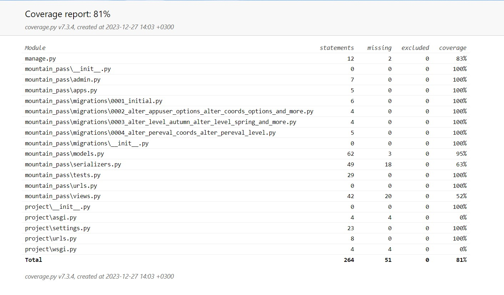

# Rest API Perevals
***
На сайте https://pereval.online/ Федерации спортивного туризма России (далее ФСТР) ведёт базу горных перевалов, которая пополняется туристами.

Студентам SkillFactory поступил заказ разработать мобильное приложение для Android и IOS, которое упростило бы задачу по отправке данных о перевале.

Пользоваться мобильным приложением будут туристы. В горах они будут вносить данные о перевале в приложение и отправлять их в ФСТР, как только появится доступ в Интернет.
Модератор из федерации будет верифицировать и вносить в базу данных информацию, полученную от пользователей, а те в свою очередь смогут увидеть в мобильном приложении статус модерации и просматривать базу с объектами, внесёнными другими.
***
_Турист с помощью мобильного приложения будет передавать в ФСТР следующие данные о перевале:_
* *__Информация о себе:__*
    * *__Фамилия__*
    * *__Имя__*
    * *__Отчество__*
    * *__Адрес электронной почты__*
    * *__Номер телефона__*
* *__Название перевала__*
* *__Координаты и высота перевала__*
* *__Уровень сложности преодоления перевала, в зависимости от времени года__*
* *__Фотографии__*

_После этого турист нажимает кнопку «Отправить» в мобильном приложении. Мобильное приложение вызовет метод __perevals__._

*__Метод:__*

'''
POST/perevals/
'''

_принимает JSON в теле запроса с информацией о перевале. Пример JSON-а:_

'''
{
  "beauty_title": "пер. ",
  "title": "Пхия",
  "other_titles": "Триев",
  "connect": "", //что соединяет, текстовое поле
 
  "add_time": "2021-09-22 13:18:13",
  "user": {"email": "qwerty@mail.ru", 		
        "fam": "Пупкин",
		 "name": "Василий",
		 "otc": "Иванович",
        "phone": "+7 555 55 55"}, 
 
   "coords":{
  "latitude": "45.3842",
  "longitude": "7.1525",
  "height": "1200"}
 
 
  level:{"winter": "", //Категория трудности. В разное время года перевал может иметь разную категорию трудности
  "summer": "1А",
  "autumn": "1А",
  "spring": ""},
 
   images: [{data:"<картинка1>", title:"Седловина"}, {data:"<картинка>", title:"Подъём"}]
}
'''

*__Результат метода: JSON__*

* _status — код HTTP, целое число:_

    _500 — ошибка при выполнении операции;_

    _400 — Bad Request (при нехватке полей);_

     _200 — успех._

* _message — строка:_

  _Причина ошибки (если она была);_

  _Отправлено успешно;_

  _Если отправка успешна, дополнительно возвращается id вставленной записи._

id — идентификатор, который был присвоен объекту при добавлении в базу данных.

*__Примеры oтветов:__*

'{ "status": 500, "message": "Ошибка подключения к базе данных","id": null}'

'{ "status": 200, "message": null, "id": 42 }'

_После того, как турист добавит в базу данных информацию о новом перевале, сотрудники ФСТР проведут модерацию для каждого нового объекта и поменяют поле status._

*__Допустимые значения поля status:__*

* _'new';_
* _'pending' — модератор взял в работу;_
* _'accepted' — модерация прошла успешно;_
* _'rejected' — модерация прошла, информация не принята._
***

*__Метод:__*

'''
GET /perevals/<id>
'''

_получает одну запись (перевал) по её id с выведением всей информацию об перевале, в том числе статус модерации._
***

*__Метод:__*

'''
GET /perevals/?user_id__email=<email>
'''

_позволяет получить данные всех объектов, отправленных на сервер пользователем с почтой._

В качестве реализации использована фильтрация по адресу электронной почты пользователя с помощью пакета **django-filter**
***

*__Документация:__*

_Документация **swagger**: http://localhost:8000/swagger-ui/_ 
***

*__Дополнительно:__*

1. _Реализовано повторное использование существующего объекта модели 'AppUser' при создании нового объекта модели 'Pereval'. Если запрос (метод 'POST/Perevals/') на добавление записи отправляет пользователь, ранее уже отправлявший такой запрос (определяется по 'email'), то для текущей записи используются ранее записанные данные пользователя, а не создается новый пользователь (объект модели 'AppUser')._
2. _Для создания и изменения объектов моделей со связанными данными вложенных сериализаторов использован пакет 'drf-writable-nested'_
***

*__Проект опубликован на хостинге pythonanywhere.com__*

_API **Pereval**: https://dimeccc.pythonanywhere.com/perevals/_

_Документация **swagger**: https://dimeccc.pythonanywhere.com/swagger/_
***

*__Отчет о покрытии тестами:__*

